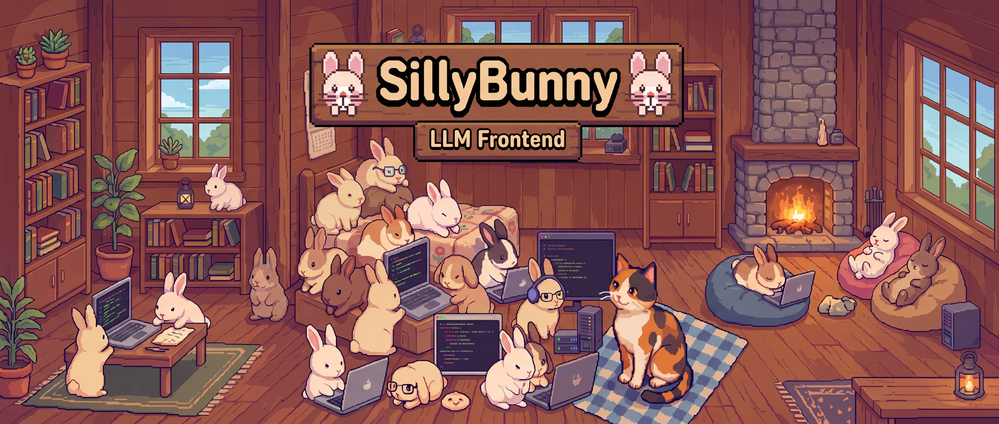
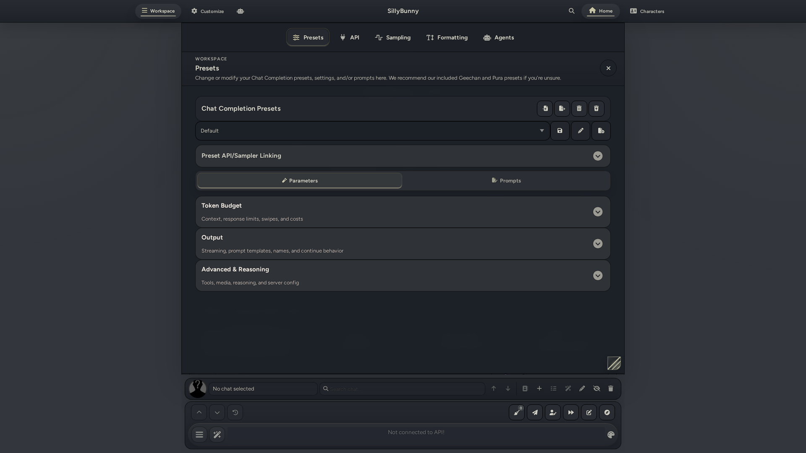
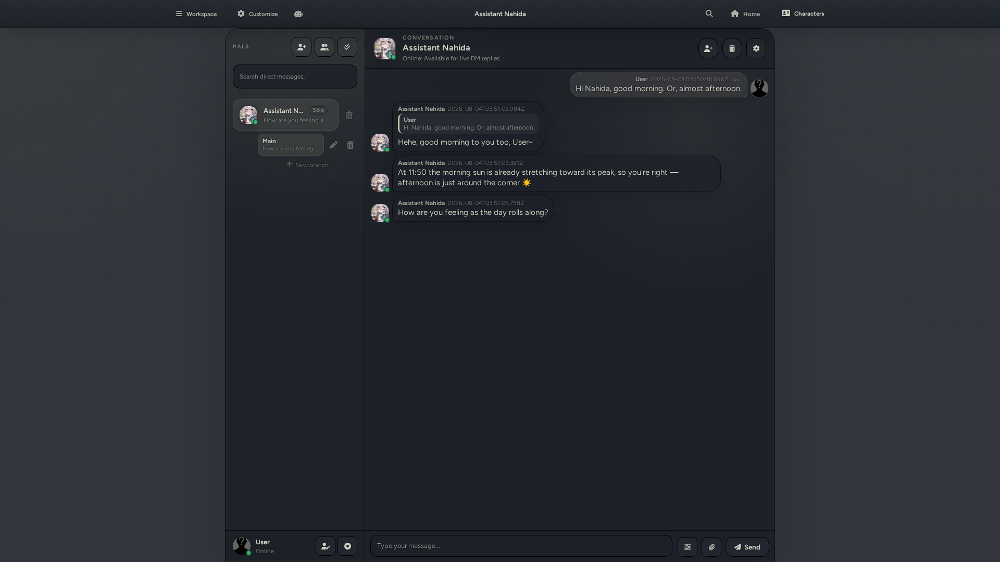
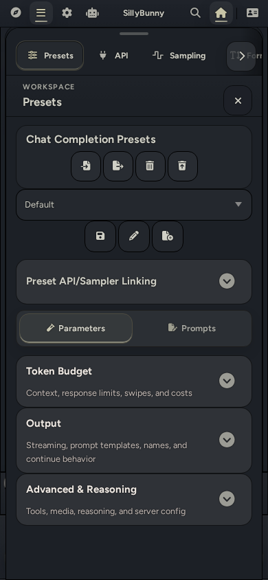
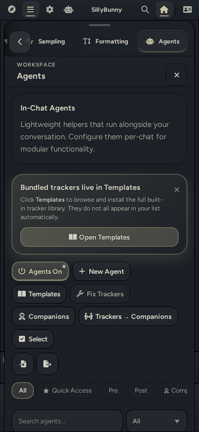

<div>

</div>

<div align="center">

[English](readme.md) | [Deutsch](readme-de_de.md) | 中文 | [繁體中文](readme-zh_tw.md) | [日本語](readme-ja_jp.md) | [Русский](readme-ru_ru.md) | [한국어](readme-ko_kr.md)

</div>

<div align="center">

**最新版本：v1.7.0。** [更新日志请见 Releases 页面。](https://github.com/SillyBunnyTeam/SillyBunny/releases)

</div>

---

## 目录
* [关于](#关于)
    * [展示](#展示)
        * [桌面端](#桌面端)
        * [移动端](#移动端)
* [安装](#安装)
    * [Staging 分支](#staging-分支)
    * [macOS 注意事项](#macos-注意事项)
    * [Termux Android 注意事项](#termux-android-注意事项)
    * [如何更新](#如何更新)
* [项目目标（也就是我们创建这个分支的原因）](#项目目标也就是我们创建这个分支的原因)
* [变更与功能](#变更与功能)
* [上游信息](#上游信息)
* [贡献者](#贡献者)
***

## 关于

SillyBunny 是 [SillyTavern](https://github.com/SillyTavern/SillyTavern) 的精致分支，其简洁的图形化外壳界面同时适配桌面端和移动端，设计灵感来自 [GNOME 项目](https://www.gnome.org/)和 [KDE Plasma](https://kde.org/plasma-desktop/)。SillyBunny 采用基于 Bun 的运行时以提升性能；提供可快速访问的 Home 页面，内含教程、指南与推荐扩展；搭载轻量级聊天内智能体系统，以支持现代智能体功能；还提供更多聊天模式，拓展角色卡的使用方式，并包含大量错误修复与常规改进！

> [!WARNING]
> 我们是一个仅由三人组成的小团队，热衷于打造简洁高效的前端，在利用 SillyTavern 出色后端成果的同时，实现我们一直希望在其中看到的所有功能。
>
> 因此，本项目仍处于开发阶段，目前仍仅具备 Beta 版质量。[请将 SillyBunny 特有的问题提交到本项目的 issue tracker。](https://github.com/SillyBunnyTeam/SillyBunny/issues) 如果问题也能在上游 SillyTavern 中复现，请改为向上游报告。
>
> 公开声明：我们在本分支的开发过程中大量使用 LLM；没有它们，本项目便无法实现。不过，整体程序与软件设计、提示词编写、测试和文档均完全由人类负责。我们对上游兼容性和项目范围执行严格标准。

<details>
<summary><h2>展示</h2></summary>

以下截图展示了桌面端与移动端图形化外壳界面中的 Workspace、Customize、Agents、Characters、搜索、Conversation 模式以及聊天内 Bunny Guide 视图。

#### 桌面端

| 桌面端 Workspace 菜单 | 桌面端 Customize 菜单 |
| :---: | :---: |
|  |  |

| 桌面端 Agents 菜单 | 桌面端 Characters 菜单 |
| :---: | :---: |
|  |  |

| 桌面端搜索 | 桌面端聊天 |
| :---: | :---: |
|  |  |

| 桌面端 Conversation 模式 |
| :---: |
|  |

#### 移动端

| 移动端 Workspace 菜单 | 移动端 Customize 菜单 | 移动端 Agents 菜单 |
| :---: | :---: | :---: |
|  |  |  |

| 移动端 Characters 菜单 | 移动端搜索 | 移动端聊天 |
| :---: | :---: | :---: |
|  |  |  |

| 移动端 Conversation 模式 |
| :---: |
|  |

</details>

---

## 安装

[在此获取最新版本。](https://github.com/SillyBunnyTeam/SillyBunny/releases/latest)

或者运行：

```bash
git clone https://github.com/SillyBunnyTeam/SillyBunny.git
cd SillyBunny
```

然后运行适用于你操作系统的启动器。它会自动安装所有依赖、检查更新并启动服务器实例。你也可以在浏览器中手动打开 `http://127.0.0.1:4444`。默认启动器会自动选择推荐的运行时；如果希望强制使用 Node.js 或 Bun，请使用对应运行时的专用启动器。

| 平台 | 默认 / 自动选择 | 强制使用 Node.js | 强制使用 Bun |
|----------|----------------|---------------|-----------|
| Windows | `.\Start.bat` | `.\Start-Node.bat` | `.\Start-Bun.bat` |
| macOS（终端） | `./Start.command` | `./Start-Node.command` | `./Start-Bun.command` |
| macOS（访达） | 双击 `Start.command` | 双击 `Start-Node.command` | 双击 `Start-Bun.command` |
| Linux / WSL | `./start.sh` | `./start-node.sh` | `./start-bun.sh` |
| Android（Termux） | `bash start.sh` | `bash start-termux-node.sh` | `bash start-termux-bun.sh` |
| Docker | `docker compose --project-directory . -f docker/docker-compose.yml up --build` | 不适用 | 不适用 |

如果你自行管理 Bun 安装，请运行 `bun run start`。其他启动方式如下：

```bash
bun run start:mobile   # 低内存模式（--smol）
bun run start:global   # 使用 SillyBunny 管理的数据路径
bun run start:no-csrf  # 禁用 CSRF（本地开发）
```

如果你通过脚本而非 `bun run` 启动，例如 pm2、systemd、Docker 或 Termux，请设置 `SILLYBUNNY_BUN_SMOL=1`，以启用与 `start:mobile` 相同的低内存模式：

```bash
SILLYBUNNY_BUN_SMOL=1 ./start.sh
```

使用 Docker 时，请在 `docker/docker-compose.yml` 的 `environment:` 下设置该变量。

`--smol` 是 Bun 的命令行标志，因此在 Node.js 模式下不起作用。

由于 Bun 存在兼容性问题，Termux、macOS 和 ARM 主机默认使用 Node.js。使用 `./start-bun.sh`（Termux：`bash start-termux-bun.sh`）可同时启用 Bun 与 `--smol`。如果选择了 Node.js 却设置了该参数，启动器会发出警告。

### Staging 分支

`staging` 分支的更新频率高于 `main` 分支，其中可能包含尚未准备好用于生产环境的改动。它的稳定性可能较低，也可能包含破坏性变更，请自行承担使用风险。

在已有的 Git 检出目录中运行：

```bash
git fetch origin staging
git switch --track origin/staging
```

如果本地已有 `staging` 分支，请改为运行 `git switch staging`。配置上游分支后，启动器可以自动更新 staging 分支，但仍要求工作树保持干净。

### macOS 注意事项

- 如果启动器窗口关闭得太快，请在终端中运行 `./Start.command`，以便保留可见的输出
- 从访达启动：双击任意 `Start*.command` 文件（如果 Gatekeeper 发出警告，请右键单击并选择“打开”）
- 如果缺少 Git，启动器会自动触发 `xcode-select --install`
- 清除 ZIP 下载文件附带的隔离元数据：`xattr -dr com.apple.quarantine /path/to/SillyBunny`
- 恢复解压后丢失的权限：`chmod +x Start*.command start*.sh scripts/*.sh`

### Termux Android 注意事项

```bash
pkg update && pkg upgrade -y
pkg install -y git curl unzip
git clone https://github.com/SillyBunnyTeam/SillyBunny.git
cd SillyBunny
bash start-termux-node.sh
```

- 在原生 Termux 和 ARM 设备上，如果 Node.js 可用，`bash start.sh` 默认使用 Node.js + npm
- 明确强制使用 Node.js：`bash start-termux-node.sh`
- 明确强制使用 Bun：`bash start-termux-bun.sh`（首次运行时会自动安装 glibc 并引导安装 `bun-termux`）
- 请将仓库放在 Termux 主目录中（例如 `~/SillyBunny`），不要放在 `~/storage/shared` 或 `/storage/emulated/0` 中；Android 共享存储会阻止 Bun 和 npm 所需的 `node_modules` 链接
- 只需运行一次 `termux-setup-storage`，即可授权 SillyBunny 访问共享文件；请勿将仓库克隆到共享存储中

Termux 上的 Bun 通过 glibc 运行，启动器会通过 `glibc-repo` 和 `glibc-runner` 安装 glibc 支持。如果 `start-termux-bun.sh` 报告这些软件包不可用，请运行 `pkg update && pkg install -y glibc-repo && pkg install -y glibc-runner` 查看底层错误信息。如果你的 glibc 不在 `$PREFIX/glibc` 中，请设置 `GLIBC_ROOT`。Node.js 不需要这些配置，因此 `bash start-termux-node.sh` 始终可作为后备方案。

### 如何更新

Git 检出目录既可通过启动器更新，也可通过 SillyBunny 本身更新。ZIP 或发布版文件夹不会使用启动器自动更新，但可以通过 Customize > Server 中的发布版 ZIP 更新器进行更新。

| 你的需求 | 命令 |
|---------------|---------|
| 从运行中的应用更新（Git 或 ZIP 安装） | 打开 Customize > Server，使用内置更新器 |
| 正常启动（自动检查更新） | `./start.sh` |
| 强制更新后启动 | `./start.sh --self-update` |
| 仅更新，不启动 | `./start.sh --self-update-only` |
| 跳过一次更新检查 | `./start.sh --skip-self-update` |
| 永久禁用自动更新 | `SILLYBUNNY_AUTO_UPDATE=0 ./start.sh` |

---

## 项目目标（也就是我们创建这个分支的原因）

我们在开发 SillyBunny 时确立了以下几个主要目标：

1. **默认简单，按需强大。** SillyBunny 的默认体验力求易于理解、直观好用，大多数复杂设置均隐藏在默认工作区之外。我们遵循精心筛选的人机界面指南（HIG）设置合理默认值，让你专注于主聊天窗口。额外的复杂功能与配置不会出现在默认视图中。我们的图形化外壳最能体现这一理念：平时不打扰你，需要时才呈现相应功能。
2. **专注于角色扮演和故事创作。** 相较于上游 SillyTavern，SillyBunny 的定位更加明确。我们的目标与模型创意写作领域高度契合，本分支的总体方向也围绕这一使用场景展开。为帮助你以有趣的方式开始使用 LLM 进行创意写作，我们预先内置了教程、预设、扩展和角色卡。
3. **功能现代化。** 我们致力于持续实现新颖有趣的功能，充分利用现代模型强大的智能体能力。其中包括完整支持聊天内的前置、伴随和后置智能体，让它们通过执行较小的任务来辅助主生成过程。我们还提供更多与角色卡互动的聊天模式，并同步修复提示词问题、支持新模型。
4. **更出色的性能。** SillyBunny 使用 Bun 作为运行时。与 Node.js 相比，Bun 通常性能更好、启动更快，并且针对现代设备进行了更充分的优化，能效也更高。我们仍然支持 Node.js，以提供冗余方案并确保兼容性。
5. **上游兼容性。** 我们尽可能与上游 SillyTavern 保持向后兼容，并利用其坚实的后端成果，让用户能够轻松从上游切换和迁移。此外，我们希望所有新功能都能适用于各种规模的模型，而不仅限于最前沿的先进模型。

## 变更与功能

### 图形化外壳

用户界面采用自定义图形化外壳，易于导航，同时适配桌面端和移动端：

- **顶部栏**：常驻顶部栏，可随时快速访问程序功能。其中包含 Workspace、Customize、Home 和 Characters 菜单选项，以及快捷操作入口。
    - **Workspace**：集中快速访问配置模型所需的全部设置。
    - **Customize**：用于自定义用户界面和 SillyBunny 后端。
    - **Agents**：用于访问智能体的快捷入口，可自定义。
    - **Global search**：快速访问的全局搜索栏，可同时查询预设、世界书、扩展、用户角色和设置，可自定义。
    - **Home**：作为起始页入口，可快速前往不同位置、查阅 SillyBunny 文档及获取推荐扩展。
    - **Characters**：用于与角色卡互动，以及导入、创建或修改角色卡。

- **底部栏**：常驻底部栏，兼作通用用户输入区域，可快速访问聊天控制功能，包括切换用户角色、切换聊天、搜索、引导生成等！

- **分层导航**：可从顶部栏轻松访问所有设置，并按不同子选项卡分类。所有内容均按层次清晰划分，减少点击或轻触次数，也减少在菜单中寻找功能所花费的时间。
- **平台适配**：同时面向桌面端和移动端设计，并为手机和平板电脑提供专用导航层。
- **灵活定制**：完整支持主题和扩展，可通过 CSS、调色板切换等方式轻松修改外壳和用户输入区域。

### 内置资源与教程

SillyBunny 默认内置了一些额外内容，帮助你立即开始创意写作：

- 详尽的 SillyBunny 教程，以及帮助你开始 LLM 角色扮演的通用指南。
- 用户界面指南。
- 内置支持 Guided Generations、Input History、Quick Image Gen、Prompt Inspector 和 Pathfinder 扩展。
- 额外提供一个精心筛选的常用扩展仓库，可直接在应用中轻松安装。示例包括 Dialogue Colors、Summary Sharder 和增强宏。
- 两套由 purachina 和 Geechan 制作的角色扮演与故事创作 Chat Completion 预设、多套由 Geechan 制作的 Text Completion 预设、一套由 Geechan 制作的聊天室预设，以及一套由 TheLonelyDevil 制作的角色卡转换预设。
- 两张可以继续为你答疑的助手卡：Bunny Guide 和 Assistant Nahida。
- 以及更多内容！

### 性能改进

在大多数受支持的客户端上，SillyBunny 使用 Bun 而非 Node.js 启动，可显著缩短启动时间、提升整体性能并延长电池续航。对于无法正常支持 Bun 的客户端，我们也支持 Node.js，同时仍可享受其他通用改进。

### 聊天内智能体

SillyBunny 完整支持以现代模型强大智能体能力为基础设计的智能体工作流。该系统直接接入角色卡，并可完全按照你的需求和偏好自定义。你可以将智能体理解为交给其他模型执行的额外任务：它们伴随主模型的生成流程运行，能以不同方式增强或修改最终输出。

我们默认提供了许多用途各异的智能体模板，包括追踪器、选项标记器、随机化工具、内容修改器和文风润色器。该系统也支持用户自行制作智能体；事实上，我们非常鼓励大家这样做！

智能体可接入生成流程的不同阶段：

**流程：**

1. **生成前智能体：** 在主模型读取提示词之前生成内容。它们适合用来设定特定规则、条件或追踪器，无需改动主预设或系统提示词。
2. **主生成：** 模型以系统提示词内容为参考，生成主要回复。
3. **伴随智能体：** 在主生成结束后附加到其旁侧，可提供独立于主生成内容的额外评论或旁注。
4. **生成后智能体：** 在主输出完全生成后对其进行修改。这样可以对生成内容执行第二轮处理，非常适合纠正问题、润色文风或改变输出方向。

### 聊天模式

**Roleplay**

这是默认体验，可让你直接与角色卡及模型互动。如果你使用过任何 LLM 前端，应当会对这种模式感到熟悉且容易上手。此模式通过底部栏中的便捷控件实现，你可以借此修改或浏览最近选择的聊天。

**Conversation**

Conversation 模式会改变用户界面，在你与角色交谈时模拟互联网即时通信客户端。它还配有相应的系统提示词和用户界面，并支持定时安排、状态、后续消息、记忆管理、图像生成等功能！与默认的 Roleplay 模式相比，你可以将它视为一种更轻松随意的体验。

---

## 上游信息

SillyBunny 是 SillyTavern 的一个分支。SillyTavern 的绝大多数行为、数据格式及生态系统相关知识仍然适用，我们也会尽可能维持上游兼容性。请在此报告 SillyBunny 特有的问题；与 SillyTavern 相关的问题则请向上游报告。

| 资源 | 链接 |
|----------|------|
| 上游仓库 | [SillyTavern/SillyTavern](https://github.com/SillyTavern/SillyTavern) |
| 上游文档 | [docs.sillytavern.app](https://docs.sillytavern.app/) |
| 上游 Discord | [discord.gg/sillytavern](https://discord.gg/sillytavern) |
| 上游 Subreddit | [r/SillyTavernAI](https://reddit.com/r/SillyTavernAI) |

如果有任何地方表现异常，请先与上游 `release` 分支进行比较。

## 贡献者

- [Platberlitz](https://github.com/platberlitz)
- [Geechan](https://github.com/Geechan)
- [TheLonelyDevil9](https://github.com/TheLonelyDevil9)

[本项目是采用 AGPL-3.0 许可的自由软件。](https://www.gnu.org/licenses/agpl-3.0.en.html)
