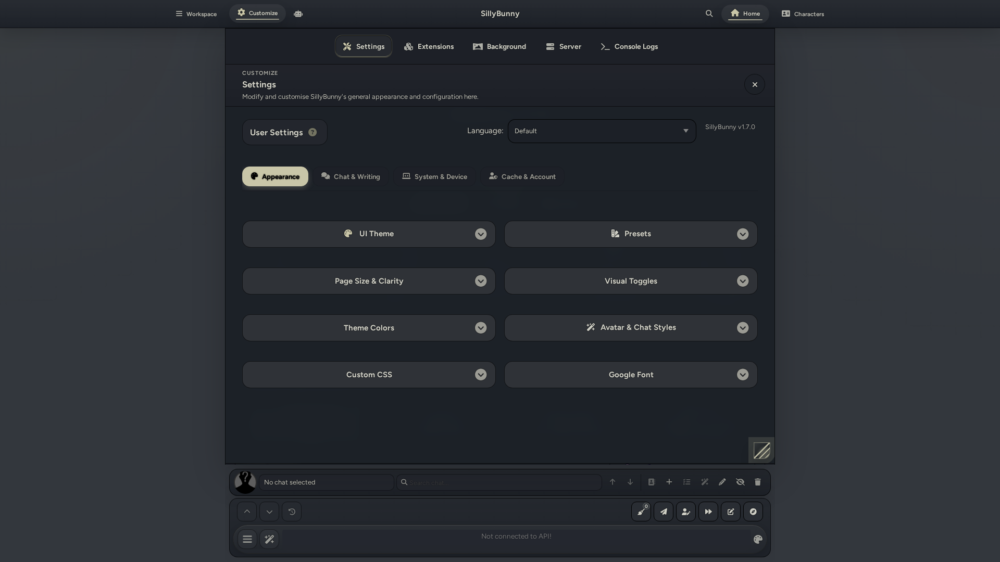
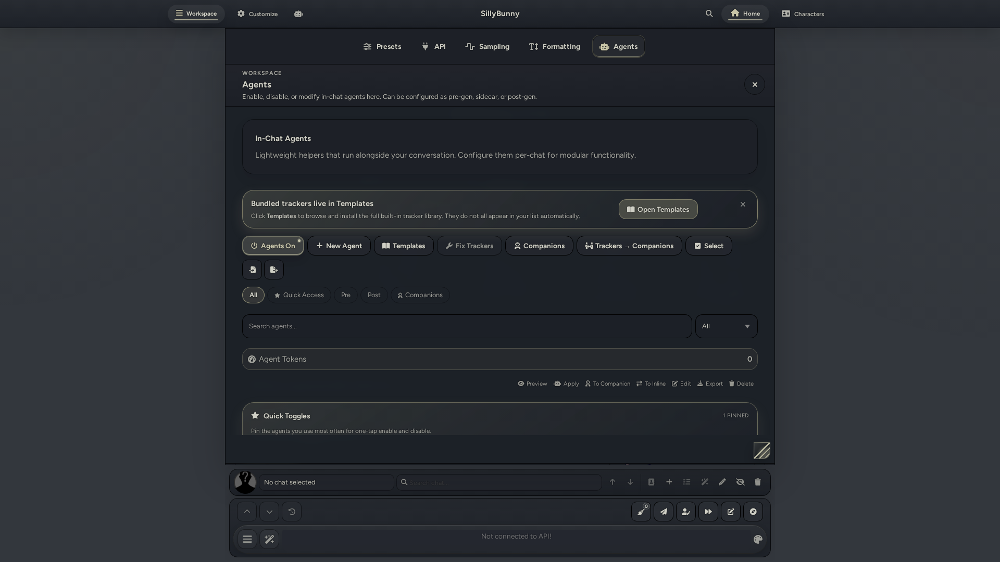
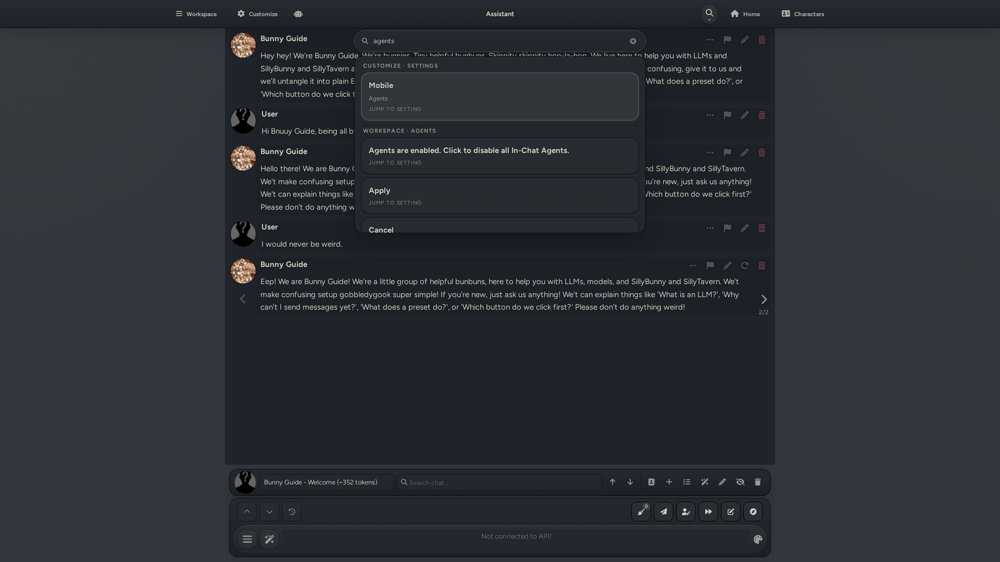
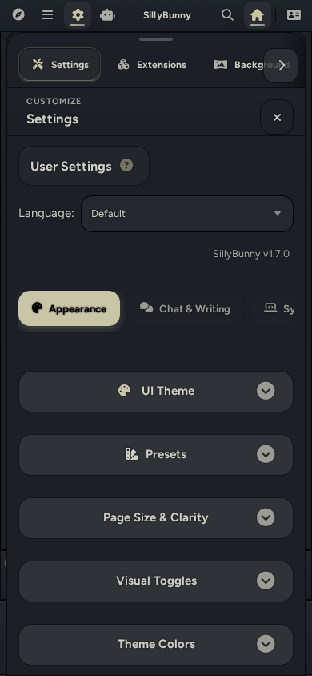
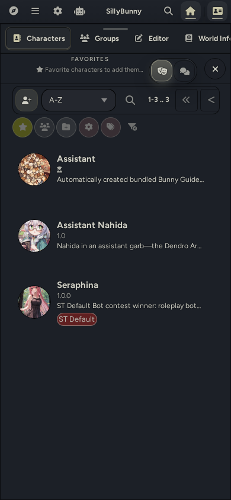
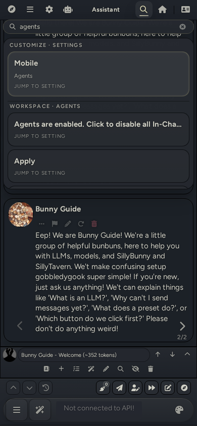
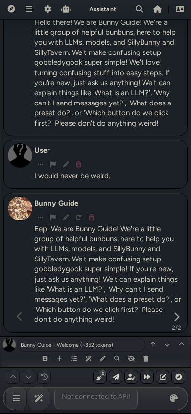
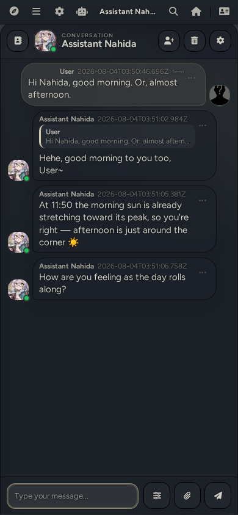

<div>

</div>

<div align="center">

English | [Deutsch](.github/readme-de_de.md) | [中文](.github/readme-zh_cn.md) | [繁體中文](.github/readme-zh_tw.md) | [日本語](.github/readme-ja_jp.md) | [Русский](.github/readme-ru_ru.md) | [한국어](.github/readme-ko_kr.md)

</div>

<div align="center">

**Latest Release: v1.7.0.** [Find changelogs in our Releases.](https://github.com/SillyBunnyTeam/SillyBunny/releases)

</div>

---

## Table of Contents
* [About](#about)
    * [Showcase](#showcase)
        * [Desktop](#desktop)
        * [Mobile](#mobile)
* [Installation](#installation)
    * [Staging Branch](#staging-branch)
    * [macOS Notes](#macos-notes)
    * [Termux (Android) Notes](#termux-android-notes)
    * [How to Update](#how-to-update)
* [Project Goals](#project-goals-aka-why-we-made-this-fork)
* [Changes and Features](#changes-and-features)
* [Upstream Information](#upstream-information)
* [Contributors](#contributors)
***

## About

SillyBunny is an elegant fork of [SillyTavern](https://github.com/SillyTavern/SillyTavern), designed with a clean, graphical shell UI for both desktop and mobile, inspired by the [GNOME project](https://www.gnome.org/) and [KDE Plasma](https://kde.org/plasma-desktop/). SillyBunny features a Bun-based runtime for improved performance; a quick-access home page with built-in tutorials, guides, and recommended extensions; a lightweight in-chat agentic system to facilitate modern agent functionality; extra chat modes to expand functionality with your character cards; and a plethora of bug fixes and general improvements!

> [!WARNING]
> We're a small team of three people who are passionate about making a simple and effective frontend that has all the features we always wished to see in SillyTavern, while leveraging the amazing work on its backend.
>
> As such, this is an in-dev fork, and is currently considered beta quality. [Please direct SillyBunny-specific issues to this project's issue tracker.](https://github.com/SillyBunnyTeam/SillyBunny/issues) If an issue is reproducible in upstream SillyTavern, please report it upstream instead.
>
> Open disclaimer: We heavily use LLMs to facilitate development of this fork, without which this wouldn't be possible. However, overall program and software design, prompting, testing, and documentation are handled entirely by humans. We hold upstream compatibility and project scope to strict standards.

<details>
<summary><h2>Showcase</h2></summary>

These screenshots show the graphical shell UI across Workspace, Customize, Agents, Characters, Search, Conversation mode, and a Bunny Guide in-chat view on desktop and mobile.

#### Desktop

| Desktop Workspace Menu | Desktop Customize Menu |
| :---: | :---: |
|  |  |

| Desktop Agents Menu | Desktop Characters Menu |
| :---: | :---: |
|  |  |

| Desktop Search | Desktop Chat |
| :---: | :---: |
|  |  |

| Desktop Conversation Mode |
| :---: |
|  |

#### Mobile

| Mobile Workspace Menu | Mobile Customize Menu | Mobile Agents Menu |
| :---: | :---: | :---: |
|  |  |  |

| Mobile Characters Menu | Mobile Search | Mobile Chat |
| :---: | :---: | :---: |
|  |  |  |

| Mobile Conversation Mode |
| :---: |
|  |

</details>

---

## Installation

[Grab the latest release here.](https://github.com/SillyBunnyTeam/SillyBunny/releases/latest)

Or run:

```bash
git clone https://github.com/SillyBunnyTeam/SillyBunny.git
cd SillyBunny
```

Then, run the appropriate launcher for your OS, which automatically installs all dependencies, checks for updates, and starts a server instance. You can also open `http://127.0.0.1:4444` manually in your browser. The default launchers choose the recommended runtime automatically; use a runtime-specific launcher if you want to force Node.js or Bun.

| Platform | Default / auto | Force Node.js | Force Bun |
|----------|----------------|---------------|-----------|
| Windows | `.\Start.bat` | `.\Start-Node.bat` | `.\Start-Bun.bat` |
| macOS (Terminal) | `./Start.command` | `./Start-Node.command` | `./Start-Bun.command` |
| macOS (Finder) | Double-click `Start.command` | Double-click `Start-Node.command` | Double-click `Start-Bun.command` |
| Linux / WSL | `./start.sh` | `./start-node.sh` | `./start-bun.sh` |
| Android (Termux) | `bash start.sh` | `bash start-termux-node.sh` | `bash start-termux-bun.sh` |
| Docker | `docker compose --project-directory . -f docker/docker-compose.yml up --build` | N/A | N/A |

If you already manage your own Bun install, run via `bun run start`. Other launch variants:

```bash
bun run start:mobile   # lower-memory (--smol)
bun run start:global   # SillyBunny-owned data paths
bun run start:no-csrf  # disable CSRF (local dev)
```

If you launch through a script rather than `bun run` — pm2, systemd, Docker, or Termux — set `SILLYBUNNY_BUN_SMOL=1` to get the same low-memory mode as `start:mobile`:

```bash
SILLYBUNNY_BUN_SMOL=1 ./start.sh
```

For Docker, set it under `environment:` in `docker/docker-compose.yml`.

`--smol` is a Bun flag, so it does nothing in Node.js mode.

Termux, macOS, and ARM hosts run on Node.js by default due to compatibility issues with Bun. Use `./start-bun.sh` (Termux: `bash start-termux-bun.sh`) to get Bun together with `--smol`. The launcher warns when the flag is set while Node.js is selected.

### Staging Branch

The `staging` branch is updated more frequently than the `main` branch and contains work that may not yet be ready for production. It can be less stable and may include breaking changes, so use it at your own risk.

From an existing Git checkout, run:

```bash
git fetch origin staging
git switch --track origin/staging
```

If you already have a local `staging` branch, run `git switch staging` instead. The launcher can update the staging branch automatically after it has an upstream configured, but it still requires a clean working tree.

### macOS notes

- If the launcher window closes too fast, run `./Start.command` from Terminal to keep output visible
- Finder launch: double-click a `Start*.command` file (right-click > Open if Gatekeeper warns)
- If Git is missing, the launcher triggers `xcode-select --install` automatically
- Quarantine metadata from ZIP downloads: `xattr -dr com.apple.quarantine /path/to/SillyBunny`
- Stripped permissions from unzip: `chmod +x Start*.command start*.sh scripts/*.sh`

### Termux (Android) notes

```bash
pkg update && pkg upgrade -y
pkg install -y git curl unzip
git clone https://github.com/SillyBunnyTeam/SillyBunny.git
cd SillyBunny
bash start-termux-node.sh
```

- `bash start.sh` defaults to Node.js + npm on native Termux and ARM devices when Node.js is available
- To force Node.js explicitly: `bash start-termux-node.sh`
- To force Bun explicitly: `bash start-termux-bun.sh` (this installs glibc and bootstraps `bun-termux` automatically on first run)
- Keep the repo inside Termux home (for example `~/SillyBunny`), not `~/storage/shared` or `/storage/emulated/0`; Android shared storage blocks the `node_modules` links Bun and npm need
- Run `termux-setup-storage` once only to grant SillyBunny access to shared files; do not clone the repo into shared storage

Bun on Termux runs through glibc, which the launcher installs via `glibc-repo` and `glibc-runner`. If `start-termux-bun.sh` reports that those packages are unavailable, run `pkg update && pkg install -y glibc-repo && pkg install -y glibc-runner` to see the underlying error. Set `GLIBC_ROOT` if your glibc lives outside `$PREFIX/glibc`. Node.js needs none of this, so `bash start-termux-node.sh` always works as a fallback.

### How to Update

Git checkouts can update through a launcher or through SillyBunny itself. ZIP/release folders do not use launcher auto-updates, but they can update through the release ZIP updater under Customize > Server.

| What you want | Command |
|---------------|---------|
| Update from the running app (Git or ZIP installation) | Open Customize > Server and use the built-in updater |
| Normal launch (auto-checks for updates) | `./start.sh` |
| Force update then launch | `./start.sh --self-update` |
| Update only, don't start | `./start.sh --self-update-only` |
| Skip update check once | `./start.sh --skip-self-update` |
| Disable auto-update permanently | `SILLYBUNNY_AUTO_UPDATE=0 ./start.sh` |

---

## Project Goals (AKA, why we made this fork)

We've developed SillyBunny with a few primary goals in mind:

1. **Simple by default; powerful when needed.** SillyBunny is designed to be simple to understand and intuitive to use by default, with most of the complex settings hidden away from the default workspace. We implement sane defaults following curated human interface guidelines (HIG) to keep your focus on the main chat window. Extra complexity and configuration are hidden from the default view. Our graphical shell best embodies this philosophy by staying out of your way until you need to access something.
2. **A focus on roleplay and storytelling.** SillyBunny has a more opinionated purpose than upstream SillyTavern. Our goals align closely with the creative writing scene for models, and the general direction of the fork is aimed at that use case. We facilitate this with pre-bundled tutorials, presets, extensions, and character cards designed to get you started with LLM creative writing in fun ways.
3. **Modernised features.** We aim to constantly implement new and interesting features that can take advantage of modern models and their strong, agentic capabilities. This includes full support for in-chat pre, sidecar, and post agents that complement the main generation via smaller tasks. We also implement extra chat modes for interacting with your character card. This is accompanied by prompt bug fixes and new model support.
4. **Better performance.** SillyBunny uses Bun as its runtime, which generally offers better performance and faster startup times and is more optimised and power-efficient for modern devices than Node.js. Node.js is still supported for redundancy and compatibility.
5. **Upstream compatibility.** We try to remain as backward-compatible with upstream SillyTavern as possible, utilising its solid backend work. This facilitates easy transitions and migrations from upstream. In addition, we aim to make all our new features compatible with models of all sizes, not just frontier, state-of-the-art models.

## Changes and Features

### Graphical Shell

The user interface features a custom, easy-to-navigate graphical shell designed for desktop and mobile:

- **Top bar**: A permanent top bar that allows for quick access to the program's features at any point. It is divided into Workspace, Customize, Home, and Characters as menu options, alongside quick action shortcuts.
    - **Workspace**: Used for quick access to all the settings needed to configure your model in one place.
    - **Customize**: Used for customizing the user interface and SillyBunny backend.
    - **Agents**: A quick access shortcut used to access agents. Can be customized.
    - **Global search**: A quick access global search bar that queries across presets, lore, extensions, personas, and settings at once. Can be customized.
    - **Home**: A start page launchpad used for quick access to various places, SillyBunny documentation, and recommended extensions.
    - **Characters**: Used for interacting, importing, and creating/modifying your character cards.

- **Bottom bar**: A permanent bottom bar functioning as a general user input field, designed for quick access to chat controls: persona switching, chat switching, search, guided generations, and more!

- **Layered navigation**: Easy access to all settings from the top bar, divided into various sub-tabs. Everything is well-defined in layers to help save on clicks/taps and minimise time spent hunting around in menus.
- **Platform-aware**: Designed for both desktop and mobile, with a dedicated phone/tablet navigation layer.
- **Malleability**: The shell and user field can easily be modified using CSS, palette swapping, and more with full theme and extension support.

### Bundled Goodies & Tutorials

SillyBunny bundles some extras by default to help you immediately get started with creative writing:

- A detailed tutorial for SillyBunny and a general guide to get started with LLM roleplaying.
- A guide to the user interface.
- Built-in support for Guided Generations, Input History, Quick Image Gen, Prompt Inspector, and Pathfinder extensions.
- An additional, curated repository of frequently used extensions that can be easily installed in the app. Examples include Dialogue Colors, Summary Sharder, and enhanced macros.
- Two roleplay/storywriting Chat Completion presets by purachina and Geechan, multiple Text Completion presets by Geechan, one chatroom preset by Geechan, and a card converter preset by TheLonelyDevil.
- Two assistant cards that can help you with further enquiries: Bunny Guide and Assistant Nahida.
- And more!

### Performance Improvements

SillyBunny starts up with Bun instead of Node.js for most supported clients, which can significantly improve startup times, general performance, and battery life. For clients that do not properly support Bun, we also support Node.js, with general improvements still applicable.

### In-Chat Agents

SillyBunny comes with full support for an agentic workflow, designed with modern models' strong agentic capabilities in mind. This system hooks directly into your character card and is fully customisable to your needs and preferences. Think of agents as additional tasks offloaded to other models that run alongside the main model generation, which can bolster or modify the final output in various ways.

By default, we've included a lot of different agent templates serving various purposes. These include trackers, choice markers, randomisers, content changers, and prose polishers. The system is also designed to allow for user-made agents; in fact, we highly encourage it!

Agents can be piped into various stages in the generation process:

**Pipeline:**

1. **Pre-generation agents:** These generate content before the main model has a chance to read the prompt. These are useful for setting specific rules, conditions, or trackers without needing to touch your main preset or system prompt.
2. **Main generation:** The model generates the main reply, using the contents of its system prompt as a reference.
3. **Sidecar agents:** These attach to the side after the main generation, which allows for extra commentary or side notes independent from the main generation.
4. **Post-generation agents:** These modify the main output once it's fully generated. This allows you to do a second pass on generated content, which can be very useful for correcting issues, prose polishing, or changing the direction of the output.

### Chat Modes

**Roleplay**

The default experience, which lets you directly interface with character cards and your model. If you've used any LLM frontend before, this should feel familiar and welcoming. This mode is facilitated by easy access to controls that modify or navigate the recently selected chat in the bottom bar.

**Conversation**

Conversation mode changes the UI by mimicking an internet messaging client when talking to your characters. This is accompanied by an appropriate system prompt and user interface, with time-based scheduling, statuses, follow-up messages, memory management, image generation support, and more! Consider this a more casual experience compared to the default Roleplay mode.

---

## Upstream Information

SillyBunny is a fork of SillyTavern. The vast majority of SillyTavern behavior, data formats, and ecosystem knowledge still apply, with upstream compatibility maintained as much as possible. Please report SillyBunny-specific issues here, while reporting SillyTavern-adjacent issues upstream.

| Resource | Link |
|----------|------|
| Upstream repo | [SillyTavern/SillyTavern](https://github.com/SillyTavern/SillyTavern) |
| Upstream docs | [docs.sillytavern.app](https://docs.sillytavern.app/) |
| Upstream Discord | [discord.gg/sillytavern](https://discord.gg/sillytavern) |
| Upstream Subreddit | [r/SillyTavernAI](https://reddit.com/r/SillyTavernAI) |

If something feels off, compare against the upstream `release` branch first.

## Contributors

- [Platberlitz](https://github.com/platberlitz)
- [Geechan](https://github.com/Geechan)
- [TheLonelyDevil9](https://github.com/TheLonelyDevil9)

[Licensed as free software under the AGPL-3.0.](https://www.gnu.org/licenses/agpl-3.0.en.html)
